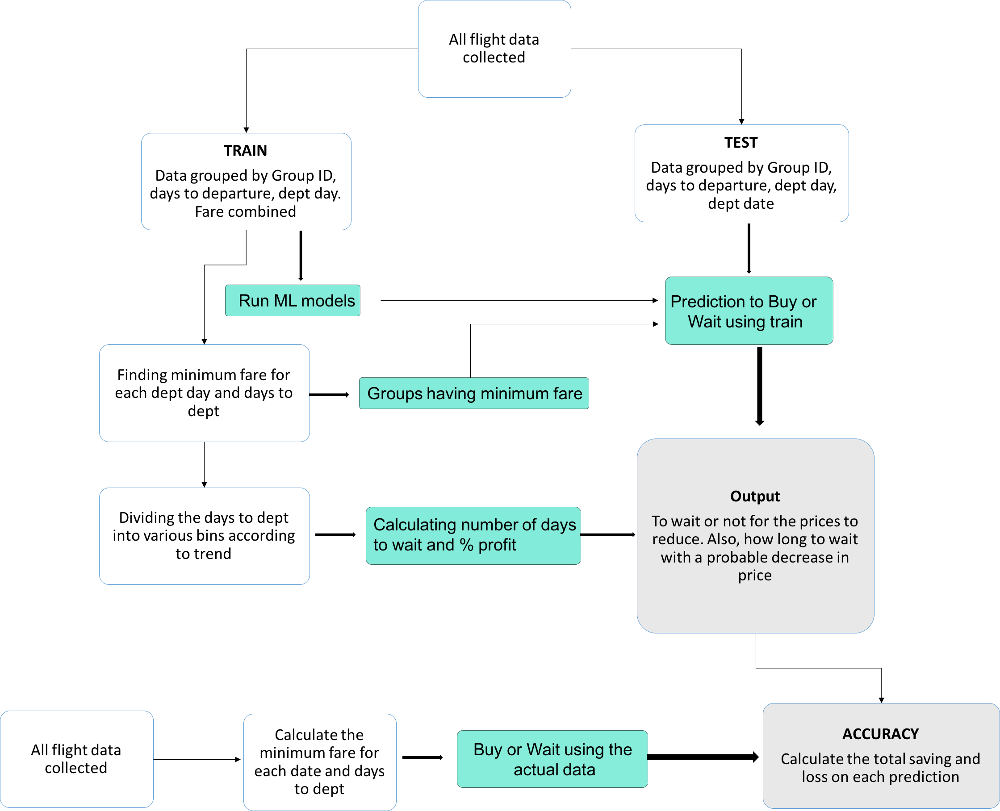

# Flight-Price-Predict-Deployment-Heroku

The objective of this article is to predict flight prices given the various parameters. This will be a regression problem since the target or dependent variable is the price (continuous numeric value)

‘Price‘ will be our dependent variable and all remaining variables can be used as independent variables.

‘Total_Stops‘ can be used to determine if the flight was direct or connecting.

Live Link: https://flight-price-predict-ritwik.herokuapp.com/

## Flow Chart

## Preview

